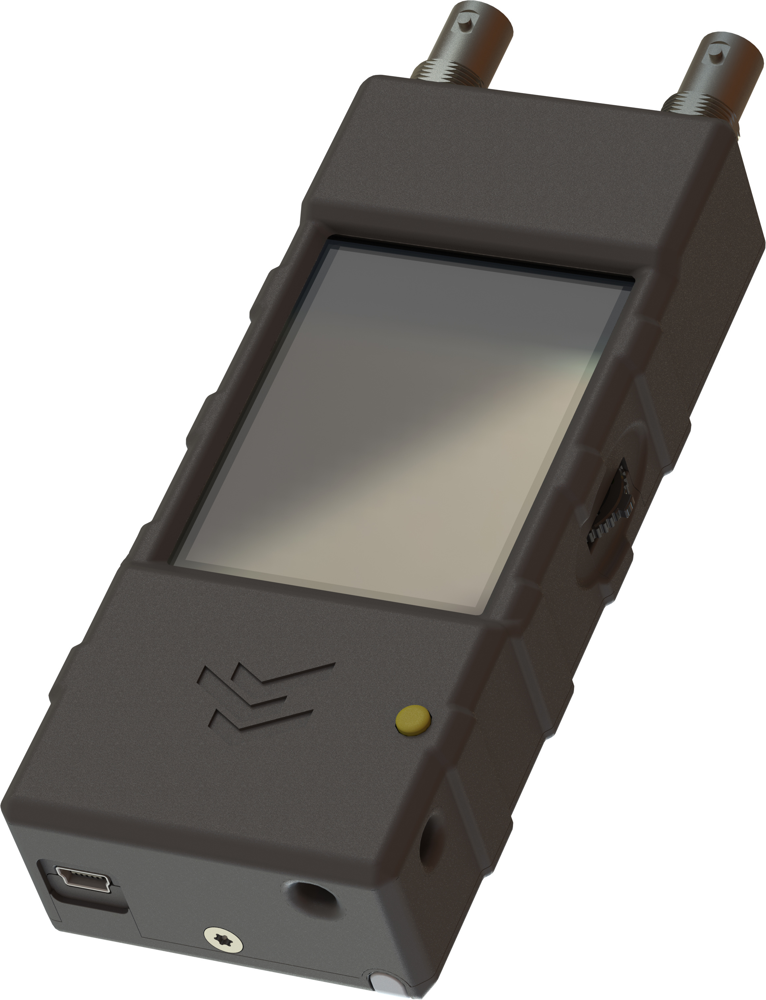
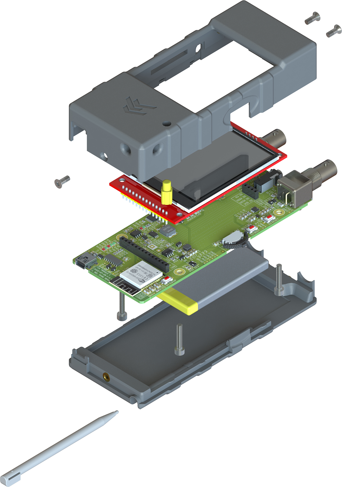

# Tree Inspection Kit (TIK) hardware

This repository contains the hardware source from my bachelor's thesis in telecommunications engineering at the University of Granada, Spain, 2022. For the firmware, see this other repo: [Bachelor_Thesis_TIK_firmware](https://github.com/dpmj/Bachelor_Thesis_TIK_firmware).

This project marks the beginning of the development of a handheld device that can measure the modulus of elasticity of wood, a figure of great value for structural purposes, in a non-destructive way by analyzing acoustic signals. Developed with the help of the GranaSAT Electronics Aerospace Group and the IDIE-ADIME Institute, this project is part of the European LIFE Wood for Future initiative. The project encompasses every step in developing an electronic product, including conception, requirements specification, architecture and components selection, topology selection, circuit and PCB design, mechanical design, manufacturing, assembly, firmware, and prototype fabrication. 

Third-party desing elements included in this repository are subject to the copyright of their respective owners.

```bibtex
@phdthesis{dpmj-tfg-2022,
    title = {Development of an acoustic measurement system of the Modulus of Elasticity in trees, logs and boards},
    author = {{Del Pino Mena}, Juan},
    type = {Bachelor's thesis},
    school = {Universidad de Granada},
    year = {2022},
    month = {9},
    url = {https://hdl.handle.net/10481/80476},
    doi = {https://doi.org/10.5281/zenodo.13935041}
}
```




